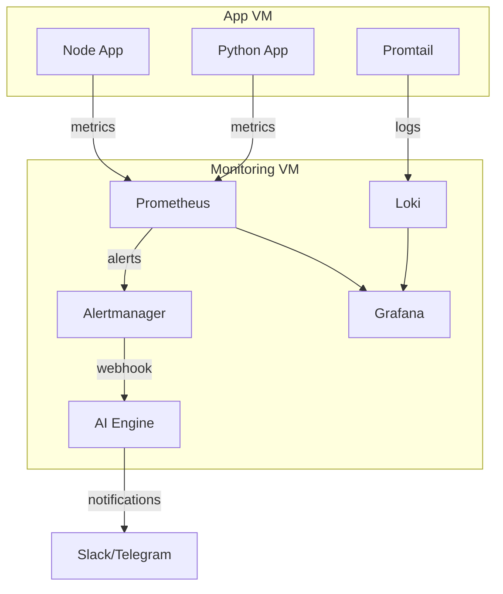

# AIOps Architecture

## Overview

This platform is built as a monitoring and intelligent incident response stack.

### Components

- **Node.js App** and **Python App**: emit metrics and JSON logs.
- **Prometheus**: scrapes metrics endpoints and evaluates alert rules.
- **Grafana**: displays dashboards and routes alerts.
- **Loki**: stores application logs and enables log queries.
- **Promtail**: collects logs from app containers and system files.
- **Alertmanager**: receives alerts and forwards them to the AI engine.
- **AI Engine**: enriches alert payloads with AI reasoning and sends Slack/Telegram notifications.

### Data flow

1. Apps produce metrics and logs.
2. Prometheus scrapes `/metrics`.
3. Promtail pushes log events to Loki.
4. Grafana displays metrics/logs.
5. Alertmanager routes alerts to AI engine.
6. AI engine analyzes, then notifies Slack/Telegram.

## Network diagram

